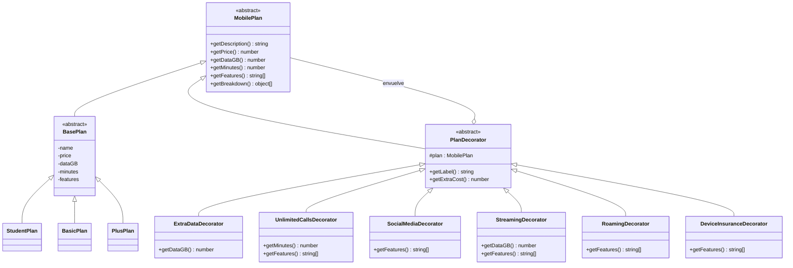

# Taller Patrón Decorator · Arma tu plan móvil

Taller de la materia **Patrones de Software** de la Universidad Cooperativa de Colombia. Apliqué el patrón estructural **Decorator** a un caso de la vida real: armar un plan de celular con servicios adicionales.

🔗 **Aplicación desplegada:** https://santiago425.github.io/patron_decorator/


📁 **Repositorio:** https://github.com/Santiago425/patron_decorator

---

## Caso de estudio

Cuando uno contrata un plan de celular, el operador ofrece un **plan base** (datos, minutos y un precio mensual) y encima de ese plan se pueden sumar **servicios adicionales**: más gigas, minutos ilimitados, roaming, redes sociales sin consumo, streaming o seguro para el equipo.

Cada adicional cambia el precio y agrega beneficios, y se pueden combinar como uno quiera. Algunos, como el paquete de datos, se pueden comprar varias veces.

### El problema

Si lo resolviera con herencia, tendría que crear una clase por cada combinación posible: `PlanBasicoConRoaming`, `PlanBasicoConRoamingYStreaming`, `PlanPlusConDatosExtraYSeguro`… Con 3 planes y 6 adicionales salen cientos de clases, y cada adicional nuevo multiplica el problema.

### La solución con Decorator

Con el patrón Decorator cada servicio adicional es una clase que **envuelve** a un plan y le agrega su comportamiento sin modificarlo. Como el decorador tiene la misma interfaz que el plan, se pueden apilar en cualquier orden y en tiempo de ejecución:

```js
const plan = new RoamingDecorator(
  new ExtraDataDecorator(
    new ExtraDataDecorator(
      new BasicPlan()
    )
  )
);

plan.getPrice();
plan.getDataGB();
plan.getFeatures();
```

Cuando se llama `getPrice()` sobre el decorador externo, este le pregunta el precio al objeto que envuelve, le suma su propio costo y devuelve el resultado. La llamada baja capa por capa hasta llegar al plan base.

---

## Participantes del patrón

| Rol en el patrón | Clase en el proyecto | Responsabilidad |
|---|---|---|
| **Component** | `MobilePlan` | Define la interfaz común: `getDescription()`, `getPrice()`, `getDataGB()`, `getMinutes()`, `getFeatures()` y `getBreakdown()`. |
| **Concrete Component** | `BasePlan` → `StudentPlan`, `BasicPlan`, `PlusPlan` | Son los planes base que se pueden decorar. |
| **Decorator** | `PlanDecorator` | Clase abstracta que guarda la referencia al plan envuelto y por defecto le delega todas las llamadas. |
| **Concrete Decorators** | `ExtraDataDecorator`, `UnlimitedCallsDecorator`, `SocialMediaDecorator`, `StreamingDecorator`, `RoamingDecorator`, `DeviceInsuranceDecorator` | Cada uno suma su costo y modifica solo lo que le corresponde (datos, minutos o beneficios). |
| **Client** | `app.js` y `catalog.js` | Arma el plan apilando los decoradores que el usuario elige y muestra el resultado. |

## Diagrama de clases



---

## Catálogo

**Planes base (componentes concretos)**

| Plan | Precio mensual | Datos | Minutos |
|---|---|---|---|
| Plan Estudiante | $22.000 | 5 GB | 200 |
| Plan Básico | $35.000 | 10 GB | 400 |
| Plan Plus | $55.000 | 25 GB | 800 |

**Servicios adicionales (decoradores concretos)**

| Servicio | Clase | Costo | Qué modifica |
|---|---|---|---|
| Paquete +10 GB | `ExtraDataDecorator` | $12.000 | Suma 10 GB. Se puede agregar varias veces. |
| Minutos ilimitados | `UnlimitedCallsDecorator` | $8.000 | Minutos pasan a ilimitados. |
| Redes sociales sin consumo | `SocialMediaDecorator` | $6.000 | Agrega el beneficio. |
| Streaming de video | `StreamingDecorator` | $18.000 | Suma 5 GB y agrega el beneficio. |
| Roaming internacional | `RoamingDecorator` | $25.000 | Agrega el beneficio. |
| Seguro del equipo | `DeviceInsuranceDecorator` | $9.900 | Agrega el beneficio. |

---

## Funcionalidades del frontend

- Elegir el plan base y cambiarlo en cualquier momento sin perder los adicionales.
- Agregar servicios adicionales; el paquete de datos se puede apilar varias veces.
- Quitar cualquier servicio de la lista y ver cómo se recalcula el plan.
- Resumen en vivo con precio total, datos, minutos y beneficios.
- Detalle del cobro capa por capa, generado recorriendo la cadena de decoradores con `getBreakdown()`.
- Sección **"Así se construyó tu plan"**, que dibuja las capas anidadas y muestra el código equivalente (`new RoamingDecorator(new ExtraDataDecorator(...))`) para ver el patrón funcionando.
- Diseño responsive para celular y computador.

## Estructura del proyecto

```
patron_decorator/
├── index.html
├── css/
│   └── styles.css
└── js/
    ├── app.js
    ├── catalog.js
    ├── core/
    │   └── MobilePlan.js
    ├── plans/
    │   ├── BasePlan.js
    │   ├── StudentPlan.js
    │   ├── BasicPlan.js
    │   └── PlusPlan.js
    └── decorators/
        ├── PlanDecorator.js
        ├── ExtraDataDecorator.js
        ├── UnlimitedCallsDecorator.js
        ├── SocialMediaDecorator.js
        ├── StreamingDecorator.js
        ├── RoamingDecorator.js
        └── DeviceInsuranceDecorator.js
```

## Tecnologías

- HTML5 y CSS3
- JavaScript (ES6+, clases y módulos nativos)
- GitHub Pages para el despliegue

No usé frameworks ni librerías externas, para que el patrón se vea claro en el código.

## Cómo ejecutarlo en local

El proyecto usa módulos de JavaScript (`type="module"`), así que no funciona abriendo el `index.html` con doble clic: hay que servirlo con un servidor local.

**Opción 1: Live Server (VS Code)**

1. Instalar la extensión *Live Server*.
2. Clic derecho sobre `index.html` → *Open with Live Server*.

**Opción 2: Python**

```bash
git clone https://github.com/Santiago425/patron_decorator.git
cd patron_decorator
python -m http.server 8000
```

Luego abrir http://localhost:8000

## Despliegue

El proyecto está desplegado con **GitHub Pages** desde la rama `main`:

1. *Settings* → *Pages*.
2. En *Source* elegir **Deploy from a branch**.
3. Rama `main` y carpeta `/ (root)` → *Save*.

A los pocos minutos queda publicado en https://santiago425.github.io/patron_decorator/

## Ventajas del patrón en este caso

- **Abierto/cerrado:** para agregar un nuevo servicio solo se crea un decorador nuevo, sin tocar los planes ni los otros decoradores.
- **Responsabilidad única:** cada decorador se encarga de un solo servicio.
- **Combinaciones en tiempo de ejecución:** el usuario arma su plan como quiera, en el orden que quiera, sin necesitar una clase por combinación.
- **Mismo contrato:** el cliente trata igual un plan base que un plan con diez decoradores, porque todos son `MobilePlan`..

## Autores 

**Santiago** · [@Santiago425](https://github.com/Santiago425)  
Laura Sofia Meza Reinoso 
Armando Monterroza
Santiago Alejandro Campoverde 
Asignatura: Patrones de Software 
Universidad Cooperativa de Colombia · Patrones de Software


---

## Patrones creacionales añadidos

Sobre el taller original (Decorator) el proyecto ahora resuelve también cuatro problemas de creación de objetos con patrones **creacionales**. Los tres planes, los seis decoradores y el comportamiento del configurador original no cambian.

| Patrón | Archivo | Qué hace aquí |
|---|---|---|
| **Prototype** | `js/prototype/PlanConfig.js` | Una configuración (`name`, `baseId`, `addonIds`) es el molde. `clone()` copia incluso el arreglo de servicios, así que editar una copia nunca daña el molde. |
| **Prototype** | `js/prototype/PlanTemplateRegistry.js` | Registro de las tres plantillas del sitio (Estudiante conectado, Viajero, Streamer). `get(id)` y `list()` siempre devuelven clones, nunca el objeto guardado. |
| **Builder** | `js/builder/PlanBuilder.js` | Arma el plan paso a paso (`base()`, `addon()`, `addons()`, `named()`) y devuelve `{ plan, config }`. Valida todo junto y lanza `PlanBuildError` con **todos** los problemas: falta el plan base, id de plan desconocido, servicio desconocido y un servicio no apilable pedido dos veces. `PlanBuilder.fromConfig(config)` reconstruye un plan desde una configuración. |
| **Abstract Factory** | `js/abstractFactory/SegmentFactory.js` | Fábrica abstracta con `StudentSegmentFactory`, `PersonalSegmentFactory` y `BusinessSegmentFactory`. Cada una construye una familia consistente: `createPlanCatalog()`, `createAddonCatalog()` y `createDiscountPolicy()`. |
| **Abstract Factory** | `js/abstractFactory/DiscountPolicy.js` | Producto de la familia: tiene `label`, `rate` y `apply(price)`, que devuelve pesos redondos. |
| **Abstract Factory** | `js/abstractFactory/segments.js` | Registro de fábricas: `SEGMENTS`, `getSegmentFactory(id)` y `createSegment(id)`. Personal es el segmento por defecto (todo el catálogo y 0% de descuento), igual que el sitio original. |

### Cómo se conectan en la interfaz

- **Selector de segmento** (Abstract Factory): solo se ven los planes y servicios de la familia elegida. Estudiante ofrece `StudentPlan` y `BasicPlan` con ExtraData, SocialMedia y Streaming, y un 10% de descuento; Empresas ofrece `BasicPlan` y `PlusPlan` con los seis servicios y un 5%. El descuento aparece bajo el total con el precio original, el descuento y el total a pagar.
- **Plantillas listas** (Prototype): cada botón carga un clon del molde con su segmento, y nunca modifica el original.
- **Configurador** (Builder): la página ya no llama `buildPlan()` directamente; usa `PlanBuilder` y muestra los mensajes de `PlanBuildError` si algo no cuadra.
- **Guardar mis planes** (Prototype + persistencia): `js/features/SavedPlansStore.js` recibe el almacenamiento en el constructor, guarda en `localStorage` y permite cargar, duplicar (`Copia de X`) y borrar.

### Pruebas

```bash
npm test
```

Son pruebas con `node:test` y `node:assert` sobre la independencia de los clones, el registro de plantillas, el Builder (incluidos los errores múltiples y la regla de no apilamiento), los catálogos y descuentos de cada fábrica, y el `SavedPlansStore` con un almacenamiento falso.
